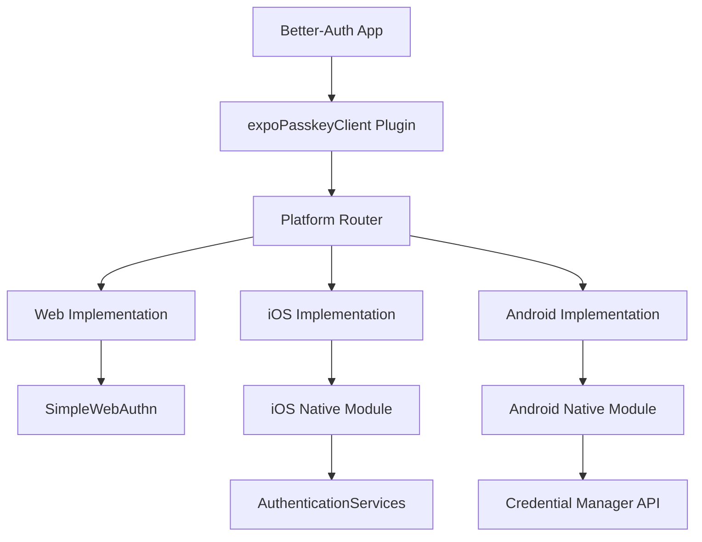
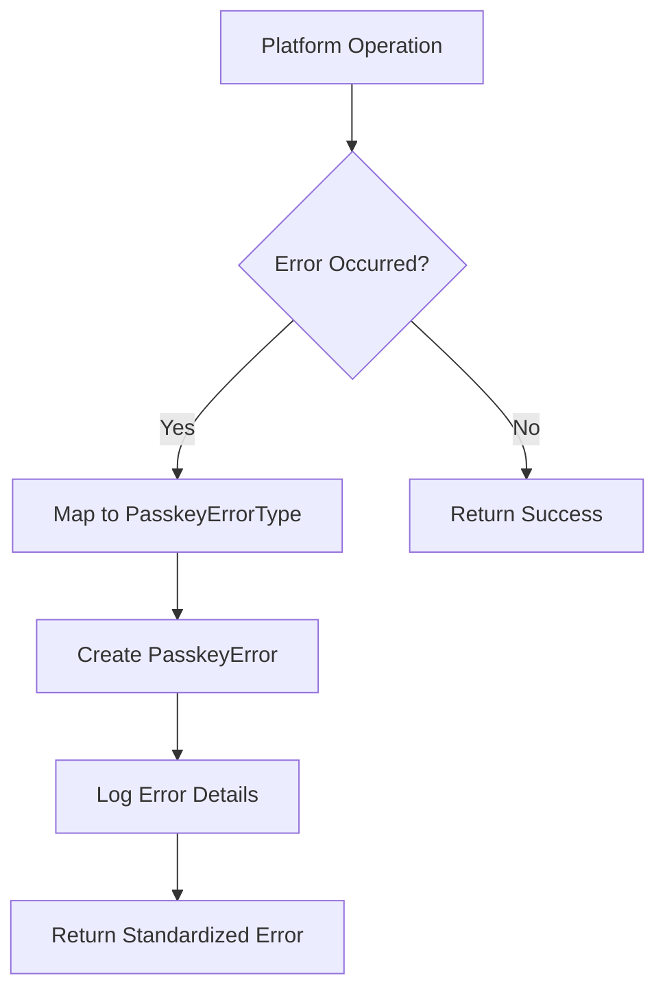

# Design Document

## Overview

The Expo Passkey Client module will provide a better-auth compatible passkey authentication solution for Expo/React Native applications. The design follows a plugin architecture where `expoPasskeyClient()` serves as a better-auth client plugin that abstracts platform-specific passkey implementations behind a unified JavaScript interface.

The module leverages platform-specific implementations:
- **Web**: SimpleWebAuthn library for WebAuthn operations
- **iOS**: AuthenticationServices framework for native passkey support
- **Android**: Credential Manager API for native passkey support

The architecture prioritizes minimal native code complexity by keeping native modules focused solely on passkey credential operations, while all business logic, data transformation, and better-auth integration happens in JavaScript.

## Architecture

### High-Level Architecture



### Module Structure

```
src/                                   # JavaScript/TypeScript source
├── index.ts                           # Main export (updated to export expoPasskeyClient)
├── expoPasskeyClient.ts              # Better-auth plugin implementation
├── BetterAuthReactNativePasskey.types.ts  # Updated types for passkey operations
├── BetterAuthReactNativePasskeyModule.ts   # Native module interface (iOS/Android)
├── BetterAuthReactNativePasskeyModule.web.ts  # Web implementation using SimpleWebAuthn
├── BetterAuthReactNativePasskeyView.tsx        # Native view component (if needed)
├── BetterAuthReactNativePasskeyView.web.tsx    # Web view component (if needed)
├── utils/
│   ├── errors.ts                     # Error handling utilities
│   ├── validation.ts                 # Input validation
│   └── transforms.ts                 # Data transformation utilities
└── __tests__/
    ├── expoPasskeyClient.test.ts
    ├── web.test.ts
    └── native.test.ts

android/                               # Android native implementation
├── build.gradle                       # Android build configuration (existing)
└── src/main/java/github/kevcube/
    └── betterauthreactnativepasskey/
        ├── BetterAuthReactNativePasskeyModule.kt    # Updated Android module
        └── PasskeyManager.kt                        # Android passkey operations

ios/                                   # iOS native implementation
├── BetterAuthReactNativePasskey.podspec            # iOS build configuration (existing)
├── BetterAuthReactNativePasskeyModule.swift        # Updated iOS module
└── PasskeyManager.swift                            # iOS passkey operations
```

## Components and Interfaces

### Core Plugin Interface

```typescript
interface ExpoPasskeyClientOptions {
  rpId: string;
  rpName: string;
  origin?: string;
  timeout?: number;
  userVerification?: 'required' | 'preferred' | 'discouraged';
}

interface PasskeyCredential {
  id: string;
  rawId: ArrayBuffer;
  response: {
    clientDataJSON: ArrayBuffer;
    attestationObject?: ArrayBuffer;
    authenticatorData?: ArrayBuffer;
    signature?: ArrayBuffer;
    userHandle?: ArrayBuffer;
  };
  type: 'public-key';
}

interface PasskeyRegistrationOptions {
  challenge: string;
  user: {
    id: string;
    name: string;
    displayName: string;
  };
  excludeCredentials?: Array<{
    id: string;
    type: 'public-key';
  }>;
}

interface PasskeyAuthenticationOptions {
  challenge: string;
  allowCredentials?: Array<{
    id: string;
    type: 'public-key';
  }>;
}
```

### Better-Auth Plugin Implementation

```typescript
export function expoPasskeyClient(options: ExpoPasskeyClientOptions) {
  return {
    id: 'expo-passkey-client',
    name: 'Expo Passkey Client',
    
    async register(registrationOptions: PasskeyRegistrationOptions): Promise<PasskeyCredential> {
      // Platform-specific registration logic
    },
    
    async authenticate(authenticationOptions: PasskeyAuthenticationOptions): Promise<PasskeyCredential> {
      // Platform-specific authentication logic
    },
    
    async isSupported(): Promise<boolean> {
      // Platform capability detection
    }
  };
}
```

### Native Module Interface

```typescript
interface PasskeyNativeModule {
  // Registration
  createPasskey(options: {
    challenge: string;
    rpId: string;
    rpName: string;
    userId: string;
    userName: string;
    userDisplayName: string;
    excludeCredentials?: string[];
    timeout?: number;
  }): Promise<{
    credentialId: string;
    clientDataJSON: string;
    attestationObject: string;
  }>;
  
  // Authentication
  getPasskey(options: {
    challenge: string;
    rpId: string;
    allowCredentials?: string[];
    timeout?: number;
  }): Promise<{
    credentialId: string;
    clientDataJSON: string;
    authenticatorData: string;
    signature: string;
    userHandle?: string;
  }>;
  
  // Capability check
  isPasskeySupported(): Promise<boolean>;
}
```

### Web Implementation Interface

```typescript
interface WebPasskeyImplementation {
  register(options: PasskeyRegistrationOptions): Promise<PasskeyCredential>;
  authenticate(options: PasskeyAuthenticationOptions): Promise<PasskeyCredential>;
  isSupported(): Promise<boolean>;
}
```

## Data Models

### Error Types

```typescript
enum PasskeyErrorType {
  NOT_SUPPORTED = 'NOT_SUPPORTED',
  USER_CANCELLED = 'USER_CANCELLED',
  INVALID_STATE = 'INVALID_STATE',
  CONSTRAINT_ERROR = 'CONSTRAINT_ERROR',
  NOT_ALLOWED = 'NOT_ALLOWED',
  TIMEOUT = 'TIMEOUT',
  NETWORK_ERROR = 'NETWORK_ERROR',
  UNKNOWN = 'UNKNOWN'
}

interface PasskeyError extends Error {
  type: PasskeyErrorType;
  originalError?: Error;
  platform: 'web' | 'ios' | 'android';
}
```

### Configuration Model

```typescript
interface PasskeyConfig {
  rpId: string;
  rpName: string;
  origin?: string;
  timeout: number;
  userVerification: 'required' | 'preferred' | 'discouraged';
  attestation: 'none' | 'indirect' | 'direct';
  authenticatorSelection?: {
    authenticatorAttachment?: 'platform' | 'cross-platform';
    requireResidentKey?: boolean;
    userVerification?: 'required' | 'preferred' | 'discouraged';
  };
}
```

## Error Handling

### Error Mapping Strategy

1. **Native Platform Errors**: Map platform-specific error codes to standardized `PasskeyErrorType` enum
2. **Web Errors**: Transform WebAuthn API errors to consistent format
3. **Network Errors**: Handle connectivity and server communication issues
4. **Validation Errors**: Catch and format input validation failures

### Error Handling Flow



### Error Recovery

- **User Cancellation**: Provide clear messaging and allow retry
- **Timeout**: Implement exponential backoff for retries
- **Not Supported**: Graceful fallback to alternative authentication methods
- **Network Issues**: Queue operations for retry when connectivity returns

## Testing Strategy

### Unit Testing

1. **Plugin Interface Tests**: Verify better-auth plugin contract compliance
2. **Platform Router Tests**: Ensure correct platform detection and routing
3. **Data Transformation Tests**: Validate credential format conversions
4. **Error Handling Tests**: Test error mapping and recovery scenarios

### Integration Testing

1. **Better-Auth Integration**: Test plugin registration and usage with better-auth
2. **Platform-Specific Tests**: Verify native module interactions
3. **Web Implementation Tests**: Test SimpleWebAuthn integration
4. **Cross-Platform Consistency**: Ensure consistent behavior across platforms

### End-to-End Testing

1. **Registration Flow**: Complete passkey registration across platforms
2. **Authentication Flow**: Complete passkey authentication across platforms
3. **Error Scenarios**: Test various failure conditions and recovery
4. **Performance Testing**: Measure operation timing and resource usage

### Testing Structure

```
__tests__/
├── unit/
│   ├── expoPasskeyClient.test.ts
│   ├── platformRouter.test.ts
│   ├── errorHandling.test.ts
│   └── dataTransforms.test.ts
├── integration/
│   ├── betterAuthIntegration.test.ts
│   ├── webImplementation.test.ts
│   └── nativeImplementation.test.ts
└── e2e/
    ├── registrationFlow.test.ts
    ├── authenticationFlow.test.ts
    └── errorScenarios.test.ts
```

## Platform-Specific Implementation Details

### Web Platform (SimpleWebAuthn)

**Location**: `src/BetterAuthReactNativePasskeyModule.web.ts`
- Replace existing web module implementation with SimpleWebAuthn integration
- Use `@simplewebauthn/browser` for client-side operations
- Implement WebAuthn API wrapper with consistent error handling
- Handle browser compatibility and feature detection
- Manage credential storage and retrieval

### iOS Platform (AuthenticationServices)

**Location**: `ios/` directory
- Update existing `BetterAuthReactNativePasskeyModule.swift` for passkey operations
- Create `PasskeyManager.swift` for passkey operations using `ASAuthorizationController`
- Handle passkey creation with `ASAuthorizationPlatformPublicKeyCredentialProvider`
- Manage authentication flows with proper UI presentation
- Convert native data structures to JavaScript-compatible formats

### Android Platform (Credential Manager)

**Location**: `android/src/main/java/github/kevcube/betterauthreactnativepasskey/`
- Update existing `BetterAuthReactNativePasskeyModule.kt` for passkey operations
- Create `PasskeyManager.kt` for passkey operations using `CredentialManager`
- Handle passkey creation with `CreatePublicKeyCredentialRequest`
- Manage authentication with `GetCredentialRequest`
- Ensure proper activity context management for UI flows

## Security Considerations

### Data Handling

1. **Credential Storage**: Never store private keys or sensitive credential data
2. **Challenge Management**: Ensure challenges are properly validated and single-use
3. **Origin Validation**: Verify RP ID and origin matching for web platform
4. **Transport Security**: Use HTTPS for all network communications

### Platform Security

1. **iOS**: Leverage Secure Enclave for key storage and operations
2. **Android**: Use hardware-backed keystore when available
3. **Web**: Rely on browser's WebAuthn implementation security
4. **Cross-Platform**: Maintain consistent security posture across platforms

### Privacy Protection

1. **User Consent**: Ensure clear user consent for biometric operations
2. **Data Minimization**: Only collect and transmit necessary credential data
3. **Anonymization**: Avoid exposing user-identifying information unnecessarily
4. **Audit Logging**: Implement security event logging for monitoring