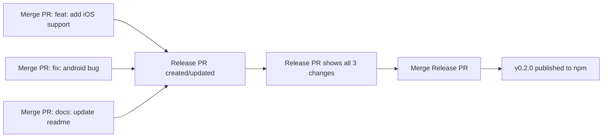

# Release Process with Release Please

## How It Works

### 1. When You Merge PRs to Main
Every time you merge a PR to `main` with conventional commit titles, Release Please will:

1. **Create or Update a Release PR** that:
   - Bumps the version in `package.json` based on commit types
   - Updates `CHANGELOG.md` with all changes since last release
   - Groups changes by type (Features, Bug Fixes, etc.)
   - Shows all commits that will be included in the release

2. **The Release PR will accumulate changes** from multiple merged PRs until you're ready to release

### 2. When You Merge the Release PR
When you merge the Release PR:
- A GitHub Release is created with the changelog
- The package is automatically published to npm
- A git tag is created for the version

## Example Flow



## What Triggers Version Bumps

Based on your PR titles (conventional commits):
- `fix:` → Patch (0.1.0 → 0.1.1)
- `feat:` → Minor (0.1.0 → 0.2.0)
- `feat!:` or `BREAKING CHANGE:` → Major (0.1.0 → 1.0.0)

## The Release PR

The Release PR will:
- Have title: `chore(main): release 0.2.0`
- Update `package.json` version
- Update `CHANGELOG.md` with:
  ```markdown
  ## [0.2.0](https://github.com/yourrepo/compare/v0.1.0...v0.2.0) (2024-01-15)
  
  ### Features
  * add iOS support ([commit](link))
  
  ### Bug Fixes
  * android bug ([commit](link))
  
  ### Documentation
  * update readme ([commit](link))
  ```

## Important Notes

1. **Release PR stays open** until you merge it - you can keep merging more PRs and it will update
2. **Only conventional commits count** - PRs without proper titles won't appear in changelog
3. **Squash merge recommended** - Use PR title as the commit message for clean history
4. **One active Release PR** - There's only ever one Release PR open at a time

## Manual Control

If you want to control when releases happen:
- Let the Release PR accumulate changes
- Review the proposed changelog
- Merge when ready to publish

If you need to make manual changelog edits:
- Edit the Release PR's description before merging
- The edits will be preserved in the final changelog
